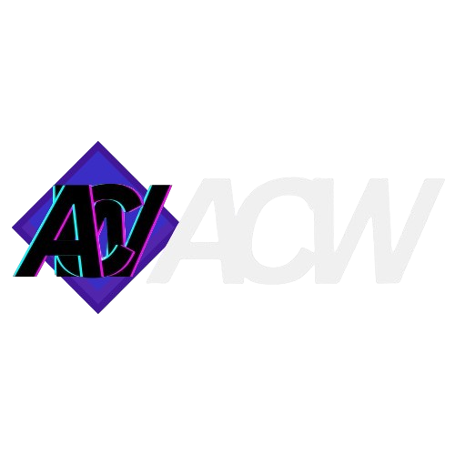

  

---

  

A software engineering student at Forward College with hands-on experience in full-stack web and Android mobile development, having built projects spanning e-commerce, cinema booking, and social networking platforms. Driven by the challenge of building complex, real-world applications – independently pursuing projects that push beyond typical coursework.

---

# Tech Stack

| Category | Technologies |
|----------|-------------|
| **Programming Languages** |      |
| **Frameworks & Libraries** |         |
| **Databases** |     |
| **Markup & Styling** |    |
| **IDE & Tools** |    |

---

# Projects

| Link | Description |
| ---- | ----------- |
|  | A full-stack game store platform, featuring game browsing, cart, wishlist, user reviews, library, friends, and a PayPal Sandbox payment simulation. Sole developer responsible for full-stack development, UI/UX design, database architecture, and admin/user role systems including banner-reactive theme changing.       |
|  | An Android cinema booking app based on my web app, featuring movie browsing, seat selection, ticket purchasing simulation, and booking management. Sole developer responsible for full-stack mobile development including admin systems for managing movies, halls, screenings, seat states, and conflict validation.     |
|  | An alumni networking platform with approval-gated access, alumni profile browsing, and an admin dashboard for user management and platform statistics. Contributed as frontend developer and UX designer, handling UI implementation, login flow, and profile pages in a 2-person team.     |

---

<h2>
  &nbsp;&nbsp;&nbsp;&nbsp;  
  &nbsp;&nbsp;&nbsp;&nbsp;&nbsp;&nbsp;&nbsp;&nbsp;name: Jeremy Ho  
  &nbsp;&nbsp;&nbsp;&nbsp;&nbsp;&nbsp;&nbsp;&nbsp;student_at: Forward College  
  &nbsp;&nbsp;&nbsp;&nbsp;&nbsp;&nbsp;&nbsp;&nbsp;email: jeremyho885@gmail.com  
  &nbsp;&nbsp;&nbsp;&nbsp;
</h2>

